  

  Hi, I'm Rafael. I build lightweight, fast software with clear architecture and as little unnecessary complexity as possible.

<h3 align="center">Toolbox</h3>

  
  
  
  
  
  
  
  
  

  

## What I care about

| Lightweight | Fast feedback | Explicit behavior |
| --- | --- | --- |
| Small surfaces, focused dependencies, and only as much machinery as the problem needs. | Short build-run-learn cycles that keep development moving. | Clear boundaries and predictable systems instead of hidden magic. |

## Currently building

### [ferrite](https://github.com/rafiistcool/ferrite)

An open-source terminal wrapper with AI-assisted command explanations, error
analysis, and suggestions — built in Rust with a focus on speed and direct
control.

## Selected work

| Project | Focus | Stack |
| --- | --- | --- |
| [ferrite](https://github.com/rafiistcool/ferrite) | Fast, extensible terminal tooling | Rust, ratatui, Tokio |
| [Spring Data JPA Campus Demo](https://github.com/rafiistcool/SWE-presentation-SpringDataJPA) | A compact, practical demonstration of persistence patterns | Java, Spring Boot, Spring Data JPA |
| [BrainPop](https://github.com/rafiistcool/WebEng_Project) | A deployed web-engineering project | Vue |

## Toolbox

  
  
  
  
  
  
  
  
  

 

  Less ceremony. More working software.

